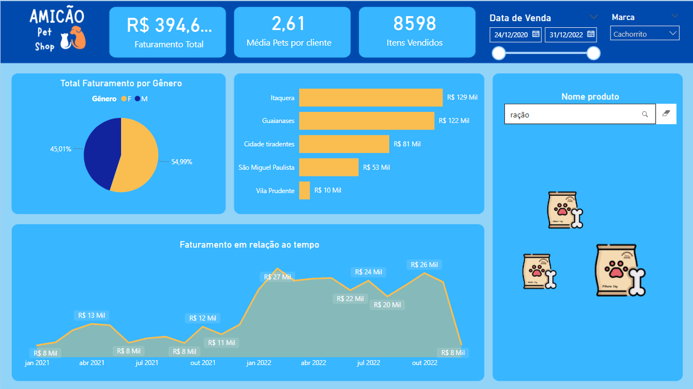

# Projeto Power BI - Amicão Pet Shop

## Descrição

Este projeto, intitulado **Amicão Pet Shop**, foi desenvolvido com base no curso **Alura - Power BI Desktop: construindo meu primeiro dashboard**. O dashboard serve para visualizar o faturamento total e possui diversas funcionalidades, incluindo:

- **Filtro para data de venda**: possibilita analisar o faturamento em períodos específicos.
- **Filtro para selecionar a marca do produto vendido**: permite filtrar os dados com base na marca.
- **Gráfico de pizza**: exibe o faturamento por gênero dos clientes (masculino e feminino).
- **Gráfico de barras clusterizado**: apresenta o faturamento por bairro.
- **Gráfico de linhas**: mostra a evolução do faturamento ao longo do tempo.
- **Campo de segmentação de dados**: permite selecionar os produtos vendidos, podendo ser pesquisados pela lista abaixo.

## Lista de Produtos

Abaixo está uma lista dos produtos analisados, que podem ser utilizados para facilitar a pesquisa e a filtragem de dados no dashboard:

- Ração filhote 1kg
- Ração adulto 1kg
- Ração sênior 1kg
- Petisco
- Ratinho
- Varinha
- Roupa de inverno
- Roupa de verão
- Coleira
- Guia
- Bolinha
- Osso

## Dashboard

Você pode acessar o dashboard diretamente através do seguinte link: [Acessar Dashboard](https://app.powerbi.com/view?r=eyJrIjoiNmEwNjAyMDAtZDA5OC00NjBhLWFlMDctMmViNGQ1ZGNmNGU5IiwidCI6ImZiOTJjMGEzLWZjNjMtNDhhOC1iNjhhLTBkODE3OWZlNTc3YSJ9)

## Como Contribuir

Sinta-se à vontade para contribuir com melhorias ou sugestões. Abra uma issue ou envie um pull request!

## Licença

Este projeto está licenciado sob a MIT License. Consulte o arquivo LICENSE para mais detalhes.

---

Agradecemos pela sua visita e esperamos que você encontre informações úteis neste dashboard!
